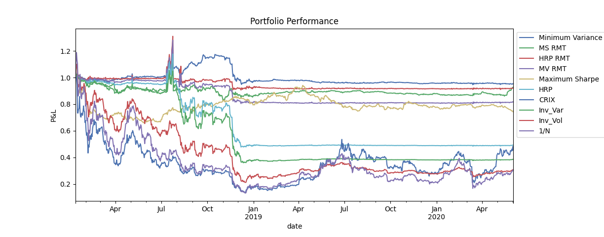

[](http://quantlet.de/)

## [](http://quantlet.de/) Automated Cryptocurrency Portfolios [](http://quantlet.de/)

```yaml

Name of QuantLet : Automated Cryptocurrency Portfolios: Portfolio Optimization, an Empirical Study.

Published in : edoc-Server Humboldt-Universität zu Berlin (Wirtschaftswissenschaften Fakultät)

Description : 'Markowitz (Global Minimum Variance, maximum Sharpe), Hierarchical Risk Parity and three simple portfolios: 
equally weighted, inverse volatility and inverse variance in the novel asset class of cryptocurrencies. The CRyptocurrency 
IndeX CRIX is used as benchmark. Portfolio optimization is computed using 120 days of daily historical data with portfolio 
rebalancing taking place every 7 days and 30 days.'

Keywords : 'portfolio optimization, mean-variance optimization, Markowitz, modern portfolio theory, random matrix theory,
eigenvalue-clipping, hierarchical risk parity, cryptocurrencies, CRIX CRyptocurrency IndeX'

Author : Morishige Takane, Guillermo Masayuki

Submitted : Sat, October 10 2020

Datafiles : Prices.xlsx

```



```yaml
Codes: The codes in the repository are according the following abbreviations 

MV: minimum variance
MS: maximum Sharpe ratio
HRP: hierarchical risk parity
RMT (Random Matrix Theory): eigenvalue-clipping of the covariance matrix
QP: quadratic programming versions

```
